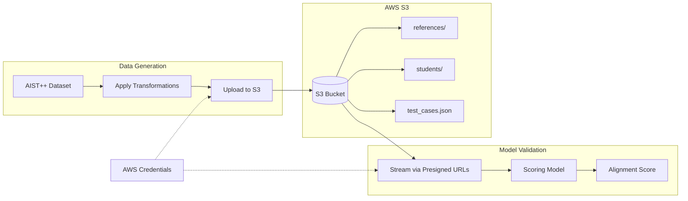
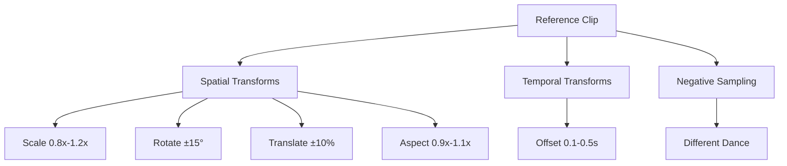

# Dancer Alignment Validation Pipeline

## High-Level Architecture

## Pipeline Flow

| Step | Description |
|------|-------------|
| 1. Source | Random clips from AIST++ dance dataset |
| 2. Transform | Apply scale, rotation, translation, temporal offset |
| 3. Upload | Push to S3 (references + transformed students + JSON) |
| 4. Validate | Stream videos, run model, compare scores to expected ranges |

## Transformation Types

